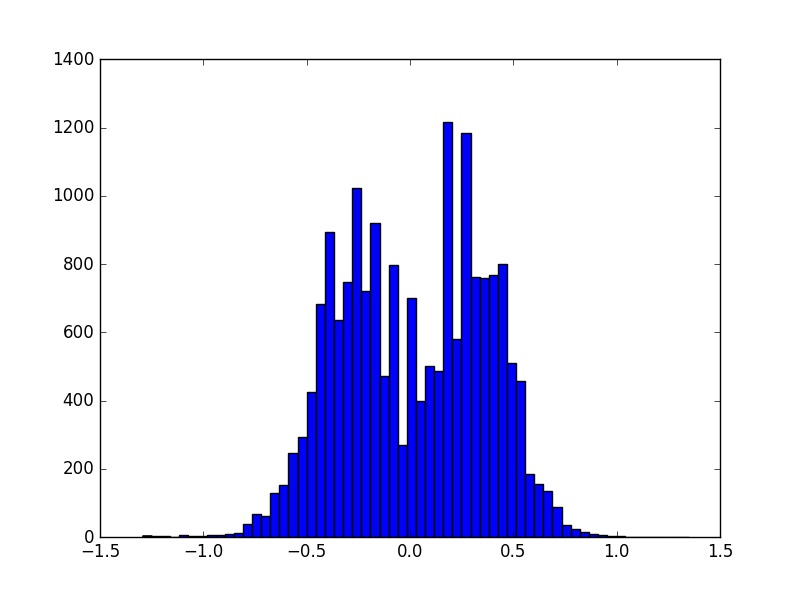
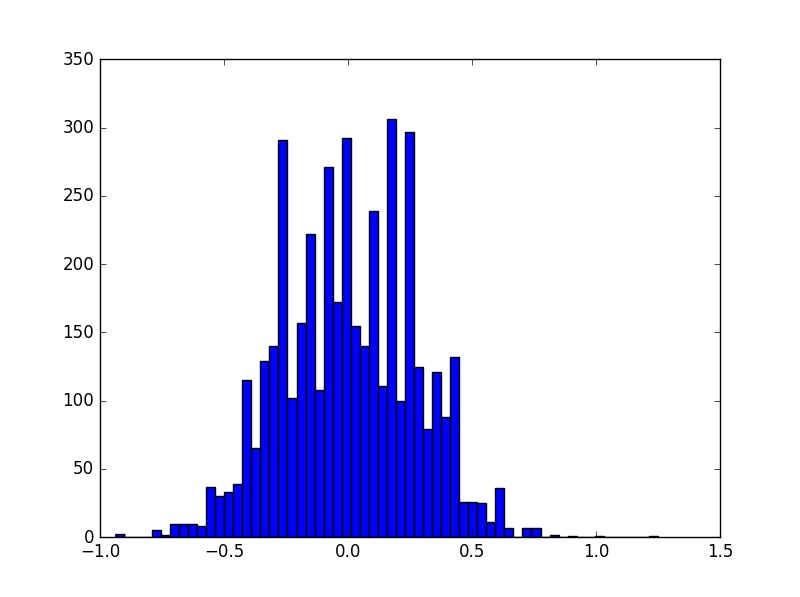

# Behavioral Cloning

The purpose of the model is to be able to pass first track in the Udacity simulator. Simulator uses train mode to record training data, images, steering and other parameters, and autonomous mode for using trained model to produce steering in response to simulator images.

The model provided uses neural network trained on a set of pre-generated simulator images to produce the weights that are then used to calculate optimal steering angle using images from autonomous mode of the simulator. The convolutional neural network architecture is chosen for this project as convolutional networks are proven to be quite accurate for many tasks that involve image processing. The neural network presented is based on the NVIDIA architecture described in the following article: <http://images.nvidia.com/content/tegra/automotive/images/2016/solutions/pdf/end-to-end-dl-using-px.pdf>. See **Model Atchitecture Design** and **Architecture Characteristics** sections for more details.

The model is trained on the set of images provided by Udacity with some exclusions and additions of augmented images from the same set. See **Data Preprocessing** section for more details on images augmentation and provided dataset distribution.

## Model Architecture Design

Network architecture is based on the network from [NVIDIA article](http://images.nvidia.com/content/tegra/automotive/images/2016/solutions/pdf/end-to-end-dl-using-px.pdf).

It starts with a set of convolutional layers. First, there are three 5 by 5 convolutions with stride 2; first layer has valid padding and latter two layers have same padding. The depth of convolutions are 24, 36 and 48 respectively.

Then it is followed by two convolutional layers 3 by 3, depth 64, same padding.

Every convolution is activated with RELU to introduce non-linearity to the model.

Then network continues with 3 fully connected layers with 100, 50 and 10 neurons respectively. They are followed by 0.5 dropout layer to avoid overfitting.

Output layer with single neuron produces single output for predicted steering.

The model is using Adam optimiser (improved version of Gradient Descent) to minimise minimum square error loss function.

## Architecture Characteristics

Convolutional neural network is used to address the problem in question because the input data is the set of images and convolutional networks are proven to be efficient model for image recognition tasks. The idea under convolutional layers is to mimic the work of the visual cortex. The network is trained to distinguich features in images. First layer activates the simplest features like edges and areas with changing contrast and subsequent layers can recognise more and more complex features. CNNs are also time and memory effective due to shared weights in convolutions. The set of fully connected layers is used towards the end of the network to share all features recognised in image and to figure out what impact each feature should have on the output result, in our case, steering.   

## Model Training

Fit_generator function from Keras library is used to fit the model in memory efficient way: it loads images batch by batch in parallel with the model training.

To produce the weights the model has been trained for 2 epochs with batch size 256. Trained model's loss on the training set reaches 0.05 after the last 2nd epoch and validation loss is 0.025. 

## Data Preprocessing

Udacity provided data is used as a starting point for training the model. The main drawback of provided data is it being unbalanced with bias towards going straight. As the result, the car cannot properly handle sharp turns and recovery from sides of the road; the steering angle produced is not enough to pass the turn/recover properly. For instance, in the first track after the bridge the car misses first turn to the left and continues to go straight off the road and never changes the steering after.  

Images preprocessing addresses this in multiple ways. We take all center camera images with steering untouched and all left and right camera images altered by 0.25 and -0.25 respectively to adjust to cameras shift. Left and right camera images are good source images to address recovery issues as they are more distant from the center of the lane.

Then we try to make the data more balanced by introducing more examples with larger steering. For non-zero steering we apply steering augmentation by 0.1, 0.15 or -0.1,-0.15 depending on angle sign for the center camera, 0.30, 0.35 for the left camera and -0.30, -0.35 for the right camera. Then all augmented data is appended to our training set. 

*An example of the left camera simulator image:*  

*An example of the center camera simulator image:*  

*An example of the right camera simulator image:* 

Training set is shuffled before and after validation split and reshuffled in every epoch.

Validation and training set histograms after adding Augmentation and reshuffle:

*Validation set histogram:* 

*Training set histogram:* 

The data is normalised in the model using Lambda function before the first convolution. Thus, normalisation is allpied both for thraining and validation sets as well as during testing in autonomous mode.

